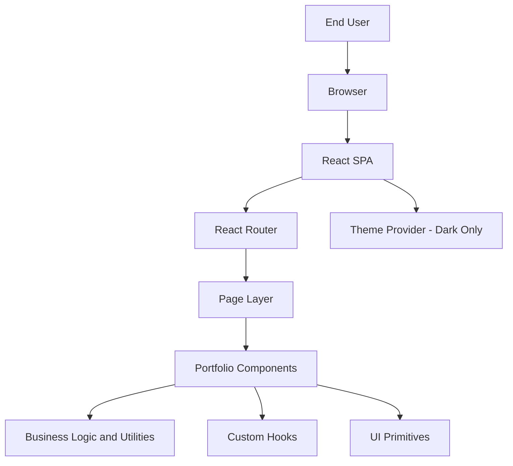
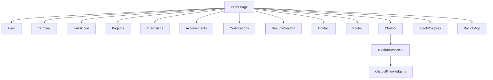
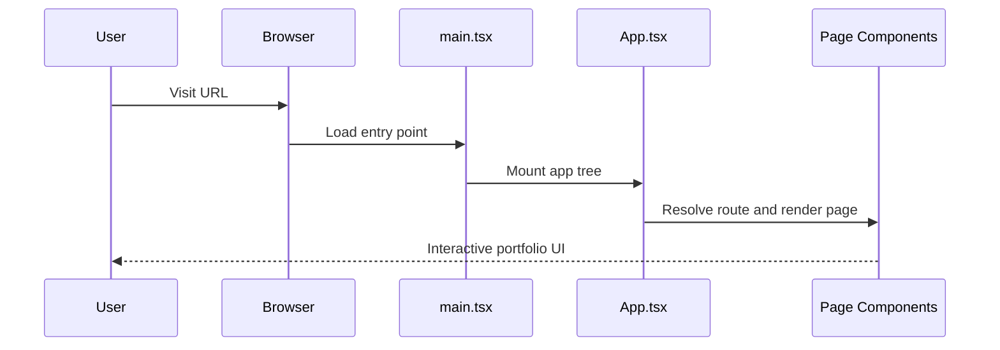
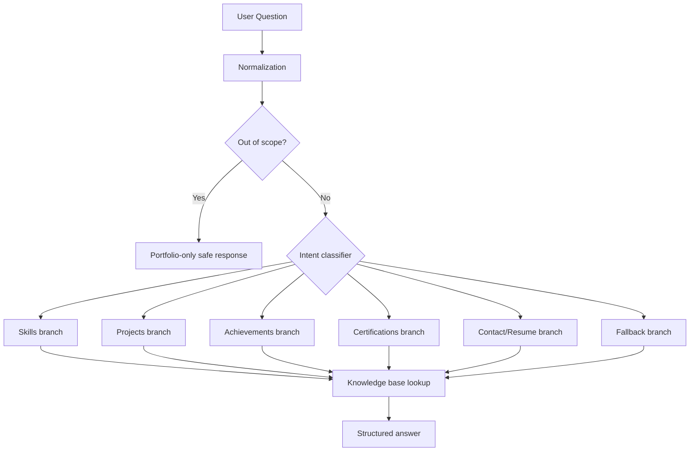

# Architecture Document - PRLR Portfolio

## 1. Main Idea And Objective
The PRLR Portfolio is a single-page, high-performance personal branding platform designed to present skills, projects, achievements, internships, certifications, and contact information in a technically credible and visually polished format.

Primary objectives:
- Deliver a fast, responsive portfolio experience.
- Keep content modular and easy to maintain.
- Provide an accurate chatbot grounded in internal portfolio knowledge.
- Ensure production readiness through clear structure and predictable build workflow.

## 2. High-Level Architecture

## 3. Layered Design
| Layer | Folder | Responsibility |
|---|---|---|
| Routing | `src/App.tsx`, `src/pages/` | Route mapping and page composition |
| Presentation | `src/components/portfolio/` | Domain-specific section rendering |
| Reusable UI | `src/components/ui/` | Primitive controls and shared UI behavior |
| Application Logic | `src/lib/` | Chatbot service, helper logic, constants |
| Cross-cutting | `src/hooks/`, `src/providers/` | Accessibility, toasts, theme context |
| Static Assets | `public/`, `src/assets/` | Media and public resources |

## 4. Component Architecture

## 5. Data Flow And Execution Flow
### 5.1 Page Rendering Flow

### 5.2 Chatbot Execution Flow

## 6. Key Modules And Responsibilities
- `src/pages/Index.tsx`: Primary page assembly.
- `src/pages/ResumePage.tsx`: Resume embedding and actions.
- `src/components/portfolio/Chatbot.tsx`: Conversation UI and message lifecycle.
- `src/lib/chatbotService.ts`: Intent analysis and response generation.
- `src/lib/chatbotKnowledge.ts`: Ground-truth portfolio facts.
- `src/providers/ThemeProvider.tsx`: Dark-only theme enforcement.
- `src/lib/performance.tsx`: Performance and vitals helpers.

## 7. Technology Choices And Rationale
- React + TypeScript: predictable and scalable UI code.
- Vite: high-speed dev/build pipeline.
- Tailwind CSS: consistent design tokens and rapid styling.
- Framer Motion: expressive transitions for key UI states.
- Radix/shadcn primitives: accessibility and reusable patterns.

## 8. Integration Details
- Routing integration: `react-router-dom` controls entry to `Index` and `ResumePage`.
- Chatbot integration: UI component calls singleton chatbot service.
- Styling integration: global styles (`index.css`) with Tailwind utility classes.
- Static meta integration: `index.html` maintains SEO/OpenGraph/Twitter tags.

## 9. Problem-Solving Approach
The architecture follows separation of concerns:
- UI concerns stay inside `components/` and `pages/`.
- Domain/logic concerns stay inside `lib/`.
- Cross-cutting behavior (theme, accessibility) stays in `providers/` and `hooks/`.

This approach reduced coupling and made feature updates safer, including:
- removal of keyboard-shortcut feature,
- dark-mode-only lock,
- chatbot accuracy enhancements.

## 10. Pros And Cons
### Pros
- Clean folder boundaries and predictable ownership.
- Strong maintainability with TypeScript and modular React components.
- Fast iteration and deployment through Vite.
- Professional UX with animation and visual hierarchy.

### Cons
- Mostly static-content architecture; large data growth may require CMS/backend.
- Bundle size can grow with animation/UI libraries if unchecked.
- Chatbot remains rule/knowledge-based, not generative.

## 11. Scalability Considerations
- Add API-backed content endpoints if portfolio data grows.
- Lazy-load heavier sections/components for better initial load.
- Introduce analytics and event tracing for user behavior insights.

## 12. Security And Reliability Notes
- No sensitive secrets are embedded in current frontend logic.
- Chatbot responses are constrained to internal knowledge-base content.
- Build/lint scripts allow repeatable verification before deployment.

## 13. Future Architecture Enhancements
- Content management layer for non-code updates.
- Internationalization support.
- End-to-end tests for core flows (navigation, chatbot, resume route).
- CI pipeline with lint/build/test gates.
