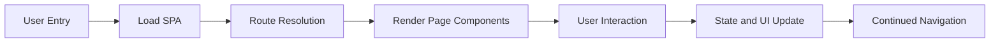
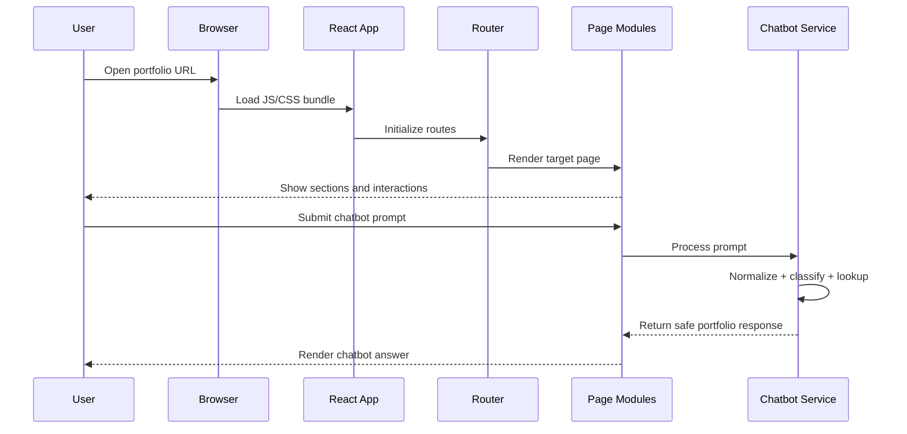
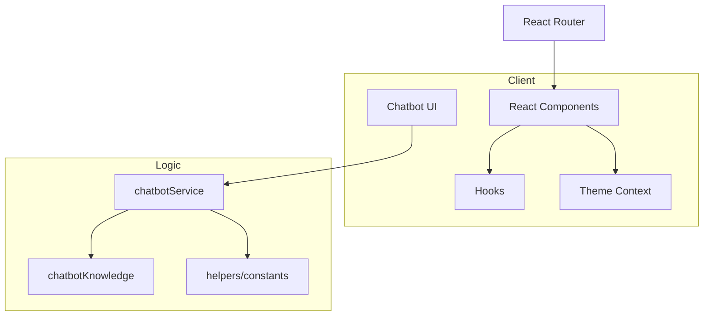

# Project Documentation - PRLR Portfolio

## 1. Project Summary
PRLR Portfolio is a dark-theme, high-impact personal portfolio web application built to present professional profile data with strong storytelling and recruiter-friendly navigation.

It combines:
- modern responsive UI,
- modular section-based information architecture,
- portfolio-accurate chatbot interactions,
- production-grade frontend engineering practices.

## 2. Vision And Objectives
### Vision
Create a portfolio that is both technically robust and visually premium.

### Objectives
- Showcase personal brand and achievements in a structured format.
- Keep all portfolio information centralized and easy to update.
- Ensure fast performance and smooth interactions.
- Enable guided Q&A through chatbot without misinformation.

## 3. Scope
### In Scope
- Portfolio homepage and resume page.
- Section modules for hero, skills, projects, internships, achievements, certifications, contact.
- In-app chatbot tied to knowledge base.
- Build, preview, and lint scripts.

### Out of Scope
- Backend API and database.
- User login/authentication.
- Admin dashboard or CMS.

## 4. Functional Modules
| Module | File/Folder | Description |
|---|---|---|
| App Shell | `src/App.tsx` | Global providers, routers, toasters |
| Landing Page | `src/pages/Index.tsx` | Composes all portfolio sections |
| Resume View | `src/pages/ResumePage.tsx` | Embedded resume and external actions |
| Chatbot UI | `src/components/portfolio/Chatbot.tsx` | Chat interface and message rendering |
| Chatbot Engine | `src/lib/chatbotService.ts` | Intent matching and response generation |
| Knowledge Base | `src/lib/chatbotKnowledge.ts` | Verified profile/project/achievement data |
| Theme Provider | `src/providers/ThemeProvider.tsx` | Dark-only mode enforcement |

## 5. End-To-End Workflow


## 6. Detailed Execution Flow


## 7. Architecture Diagram


## 8. Folder Organization
```text
src/
|-- components/
|   |-- portfolio/
|   `-- ui/
|-- hooks/
|-- lib/
|-- pages/
|-- providers/
|-- App.tsx
|-- main.tsx
`-- index.css
```

## 9. Data Flow
### Static Content Flow
1. Portfolio content is authored in section components and `chatbotKnowledge.ts`.
2. Pages consume content and render visual blocks.
3. User sees deterministic, version-controlled portfolio data.

### Chatbot Data Flow
1. User submits question.
2. Service normalizes text and checks intent/out-of-scope.
3. Service maps to knowledge categories.
4. Response is returned and rendered in chat UI.

## 10. Tech Stack And Selection Rationale
| Technology | Purpose | Benefit |
|---|---|---|
| React | UI composition | Reusable components and declarative rendering |
| TypeScript | Type safety | Fewer runtime mistakes and cleaner refactors |
| Vite | Tooling | Fast startup/build and modern bundling |
| Tailwind CSS | Styling | Consistency and speed in UI implementation |
| Framer Motion | Animations | Professional transitions and interaction cues |
| React Router | Navigation | Predictable route management |
| Radix/shadcn | UI primitives | Accessibility and reusable patterns |

## 11. Problem-Solving Approach
The project follows iterative improvement with validation loops:
- Implement feature.
- Run build/lint validation.
- Refine UX and logic for accuracy.
- Push changes only after passing checks.

Recent examples of this approach:
- chatbot accuracy and intent hardening,
- removal of keyboard shortcuts feature,
- migration to dark-only mode.

## 12. Pros And Cons
### Advantages
- Strong visual identity and polished UX.
- Easy to maintain due to modular architecture.
- Good developer ergonomics with Vite + TypeScript.
- Controlled chatbot scope reduces incorrect answers.

### Trade-Offs
- No backend means content updates require code changes.
- Rule-based chatbot is limited compared to LLM-backed systems.
- Rich animations can increase bundle size if expanded.

## 13. Integration Points
- `index.html`: metadata for SEO and social sharing.
- `App.tsx`: shared providers and route orchestration.
- `ThemeProvider`: enforces visual consistency globally.
- `Chatbot.tsx` + `chatbotService.ts`: user-to-knowledge interaction pipeline.

## 14. Local Development And Operations
### Install
```bash
npm install
```

### Development
```bash
npm run dev
```

### Build
```bash
npm run build
```

### Preview Build
```bash
npm run preview
```

### Lint
```bash
npm run lint
```

## 15. Quality And Verification Checklist
- [x] Project builds successfully.
- [x] Routing works for homepage and resume page.
- [x] Chatbot returns portfolio-grounded responses.
- [x] Dark mode remains enforced (no user toggle).
- [x] Documentation files are complete and linked.

## 16. Future Improvements
- Introduce CMS-backed editable content.
- Add automated test coverage for chatbot intents.
- Add CI workflow for lint/build gates.
- Optimize bundle splitting for large sections.
- Add analytics dashboards for visitor behavior.
